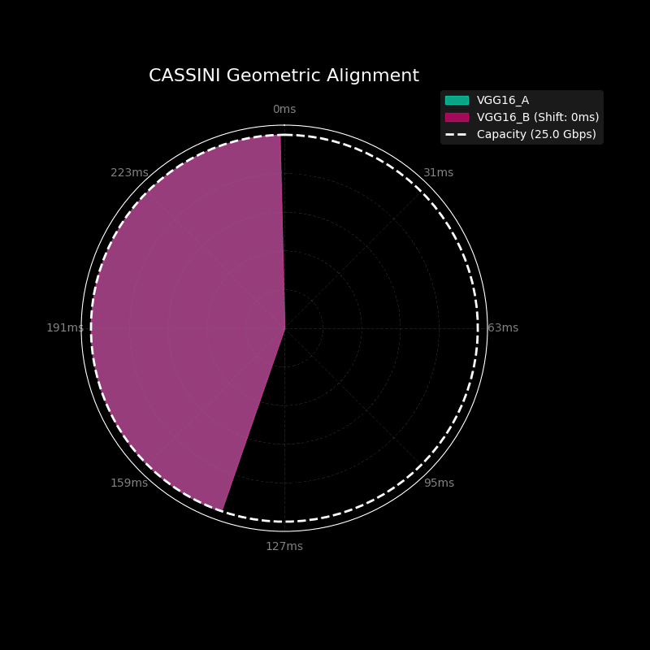
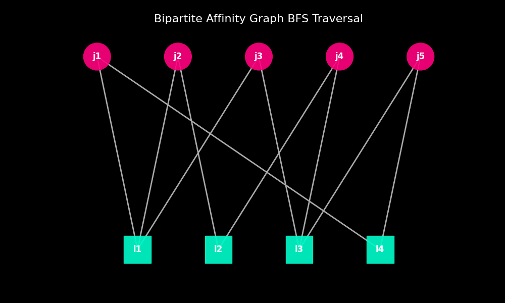
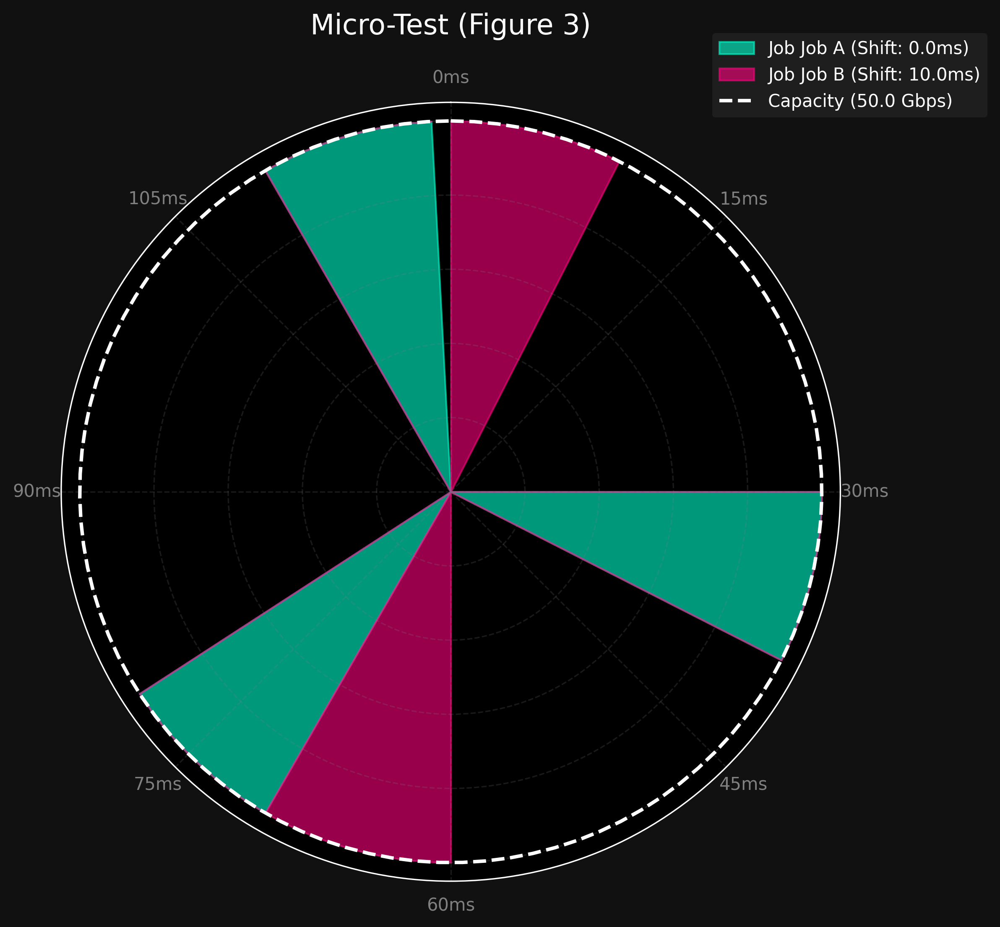
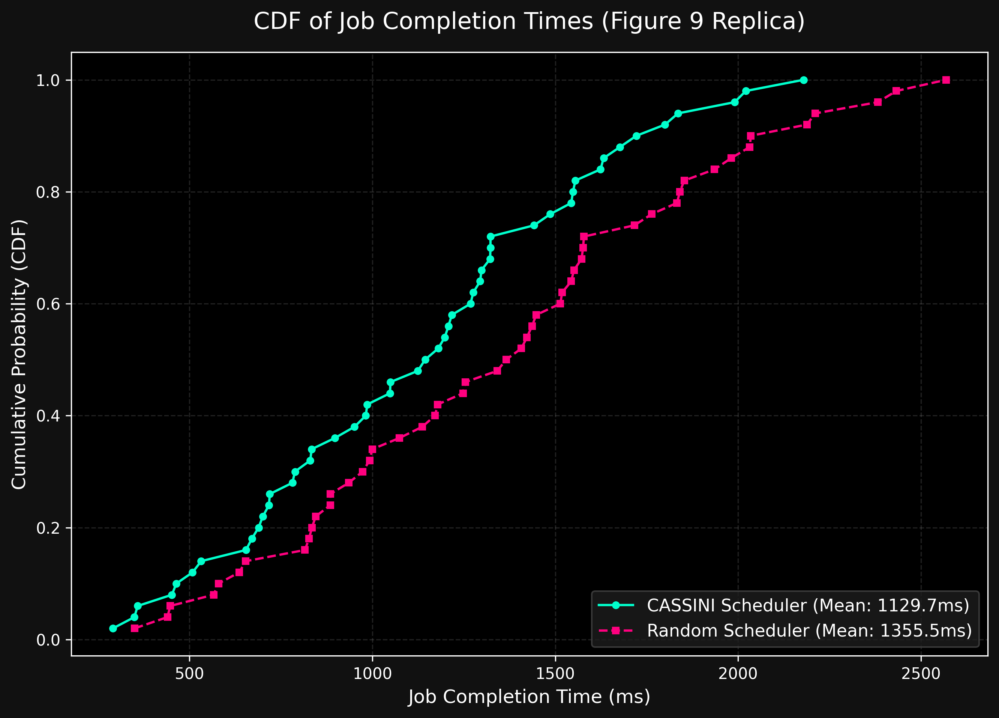
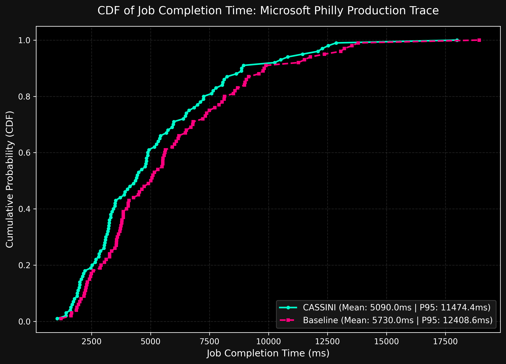
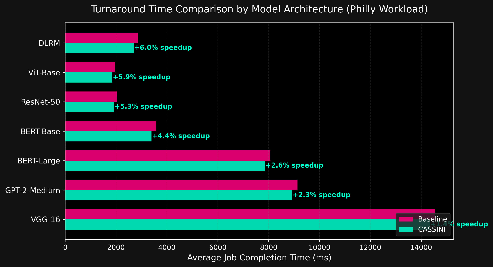
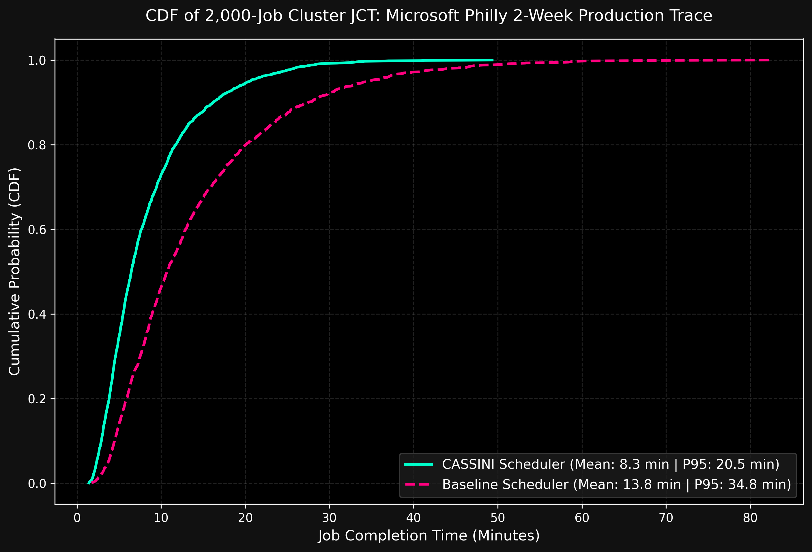
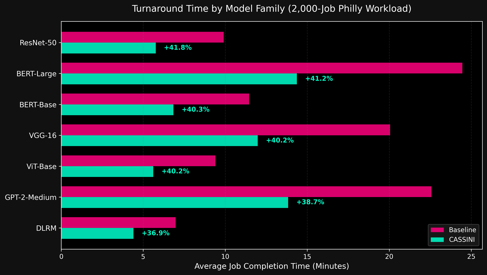
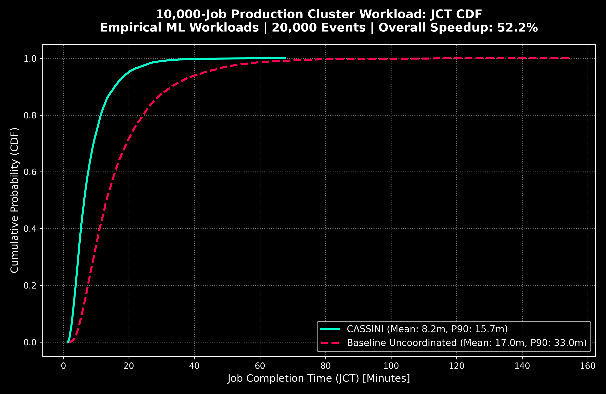
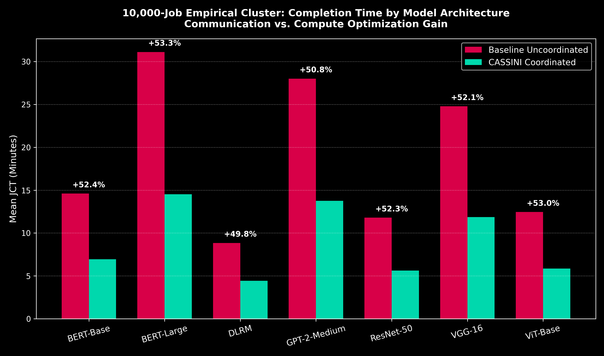

# CASSINI: Network-Aware Job Scheduling in ML Clusters

[](https://www.python.org/)
[](https://opensource.org/licenses/MIT)
[](https://www.usenix.org/conference/nsdi24/presentation/rajasekaran)
[]()

A lightweight, purely algorithmic and discrete-event Python simulation of **CASSINI**, the network-aware deep learning scheduler introduced at **USENIX NSDI '24**.

This project provides a standalone mathematical testbed to validate CASSINI's geometric abstractions, circular phase-interleaving algorithms, bipartite graph conflict resolutions, and discrete-event cluster timelines—completely isolated from heavy GPU hardware constraints or deep learning runtimes.

---

## Core Concepts Modeled

Distributed deep learning training alternates cyclically between **Compute** (GPU forward/backward pass) and **Communication** (AllReduce gradient synchronization). When multiple training jobs share bottleneck switches and links in a cluster, uncoordinated communication bursts collide, creating packet buffers, queuing delay, and severe tail latencies.

CASSINI introduces three foundational techniques to eliminate these bottlenecks:

### 1. Geometric Bandwidth Abstraction & Circular Phase Interleaving
CASSINI models repeating training iterations as geometric circles whose perimeter equals the iteration time ($T_{\text{iter}}$). Multiple jobs sharing a link are projected onto a **Unified Circle** with a perimeter equal to the Least Common Multiple (LCM) of their iteration times:
$$\text{Perimeter} = \text{LCM}(T_1, T_2, \dots, T_k)$$
By rotating these circles (applying mathematical time-shifts $\tau_i$), CASSINI slots the communication bursts of one job directly into the compute valleys of others—achieving **zero network collisions** on shared links.

<p align="center">
  
</p>

### 2. Multi-Link Conflict Resolution via Bipartite Affinity Graphs
In modern clusters, jobs traverse multiple links and share different bottleneck paths with different co-runners. Shifting a job to resolve contention on Link $A$ might inadvertently create a collision on Link $B$.

CASSINI models the cluster topology as a **Bipartite Affinity Graph** $G = (U, V, E)$, where:
- Nodes $U$ represent Jobs
- Nodes $V$ represent Network Links
- Edges $E$ carry optimal relative phase shifts determined by the link optimizer

Using **Algorithm 1 (BFS Traversal)**, CASSINI walks the connected acyclic subgraphs, propagating globally consistent, collision-free time-shifts cluster-wide without mathematical contradictions.

<p align="center">
  
</p>

### 3. Loop-Free Placement Evaluation & Time-Based Event Simulation
- **Placement Evaluator**: Evaluates cluster placement candidates generated by cluster managers (e.g., Themis/Tiresias), detects and discards cyclic configurations using BFS cycle detection, scores compatibility, and selects the optimal layout.
- **Master Event Simulator**: A priority-queue discrete-event engine (`Simulator`) tracking job arrivals, dynamic re-routing, iterations, completion progress, and contention-induced dilation of communication times.

---

## Directory Structure

```text
cassini-simulation/
├── data/                         # Empirical real-world datasets & traces
│   ├── models/                   # Empirical ML model profiles (VGG, ResNet, BERT, GPT, ViT, DLRM)
│   │   └── real_models.json
│   └── traces/                   # Production cluster workload traces (Microsoft Philly)
│       ├── philly_cluster_trace.json # 60-job snapshot trace
│       ├── philly_2000_jobs.json     # 2,000-job production trace (~2 weeks)
│       └── philly_10000_jobs.json    # 10,000-job ultra-scale trace (~1.5 months)
├── src/                          # Core CASSINI framework
│   ├── core/                     # Data models & trace loader
│   │   ├── __init__.py
│   │   ├── models.py             # Phase, Job, Link, Server, Cluster dataclasses
│   │   └── trace_loader.py       # Model profile parser & Philly trace ingestion
│   ├── math_engine/              # Mathematical algorithms & graph engines
│   │   ├── __init__.py
│   │   ├── graph.py              # Bipartite Affinity Graph & BFS Traversal (Algorithm 1)
│   │   └── optimizer.py          # Circular rolling phase interleaver & LCM math
│   ├── scheduler/                # Evaluation & discrete-event simulation loop
│   │   ├── __init__.py
│   │   ├── evaluator.py          # Candidate evaluation, scoring & loop filtering
│   │   └── simulator.py          # Master discrete-event cluster simulator (incremental & batch)
│   └── utils/                    # Visualization & animation tools
│       ├── __init__.py
│       ├── animator.py           # GIF generation for phase & graph animations
│       ├── graph_animator.py     # BFS affinity traversal animation
│       └── visualizer.py         # Static plotting (linear, circular, topology)
├── examples/                     # Standalone demo scripts for paper concepts
│   ├── demo_link_optimizer.py    # Link-level phase collision & circular interleaving
│   ├── demo_affinity_graph.py    # Bipartite graph construction & BFS traversal
│   ├── demo_evaluator.py         # Multi-candidate ranking & cycle detection
│   └── demo_simulator.py         # Event loop with dynamic arrival/departure
├── experiments/                  # Baseline validation & real-world experiments
│   ├── micro_test.py             # Replicating Figure 3 (Geometric 30° shift)
│   ├── macro_test.py             # Replicating Figure 9 (50-job cluster JCT CDF)
│   ├── real_workload_experiment.py # Microsoft Philly trace with real ML models
│   ├── large_scale_2000_jobs.py  # 2,000-job production cluster experiment
│   └── scale_10000_jobs.py       # 10,000-job ultra-scale parallel experiment
├── tests/                        # Comprehensive unit tests
│   ├── test_models.py
│   ├── test_optimizer.py
│   ├── test_graph.py
│   ├── test_evaluator.py
│   ├── test_simulator.py
│   └── test_trace_loader.py
├── visualizations/               # Output charts, CDF plots, and animations
├── Makefile                      # Cross-platform CLI shortcuts
├── requirements.txt              # Dependency specifications
└── README.md
```

---

## Quick Start

### 1. Installation

Clone the repository and install dependencies:
```bash
git clone https://github.com/hskad/cassini-simulation.git
cd cassini-simulation
pip install -r requirements.txt
```

> **Note for Windows Users**:
> Use `python` in Command Prompt / PowerShell rather than `python3` (which can map to the Windows Store stub). On Linux/WSL/macOS, use `python3`.

---

## Phase 1: Baseline Validation (Paper Replication)

We have built end-to-end experiment scripts with full CLI argument support to mathematically replicate the key figures from the CASSINI paper:

### 1. The Micro-Test (Figure 3 Replica)
Tests two jobs sharing a single bottleneck link:
- **Job A**: 40ms iteration (30ms compute, 10ms comm)
- **Job B**: 60ms iteration (50ms compute, 10ms comm)
- **Unified Circle Perimeter**: $\text{LCM}(40, 60) = 120\text{ ms}$

```bash
python experiments/micro_test.py
```

<p align="center">
  
</p>

- **Validation Result**: 
  - **100.0% Compatibility Score** (Zero collision)
  - Optimal Job B time shift: **$10.0\text{ ms}$**
  - Geometric phase shift: **$\frac{10\text{ ms}}{120\text{ ms}} \times 360^\circ = \mathbf{30.0^\circ}$** (Exact Figure 3 replication)

Custom parameters can be tested:
```bash
python experiments/micro_test.py --compute-a 30 --comm-a 10 --compute-b 50 --comm-b 10 --capacity 50
```

---

### 2. The Macro-Test (Figure 9 Replica)
Runs a discrete-event cluster simulation comparing the **CASSINI Scheduler** against a **Random Baseline Scheduler** across 50 multi-iteration distributed ML training jobs competing over bottleneck links.

```bash
python experiments/macro_test.py
```

<p align="center">
  
</p>

```text
--- Results Summary ---
Average JCT (CASSINI): 1129.74ms
Average JCT (Random) : 1355.48ms
Performance Gain    : 16.7% faster with CASSINI
```

#### How to Interpret the CDF Graph:
- **X-Axis (Job Completion Time in ms)**: Total turnaround time from job arrival to completion. Lower values (further left) represent faster completions.
- **Y-Axis (Cumulative Probability)**: The proportion of all 50 cluster jobs completed (from 0% to 100%).
- **Shifted Left is Better**:
  - **Median JCT (P50)**: CASSINI finishes 50% of the workload at **$\sim 1150\text{ ms}$**, whereas the baseline Random scheduler requires **$\sim 1420\text{ ms}$** ($\approx 270\text{ ms}$ faster).
  - **Tail Latency (P90)**: 90% of CASSINI jobs complete by **$1750\text{ ms}$**, while Random scheduling suffers from cascading collisions with jobs dragging out past **$2560\text{ ms}$**.
  - **Physical Mechanism**: CASSINI's circular interleaving prevents packet drops and network queueing on bottleneck links, enabling jobs to transmit at full line rate without contention.

Custom cluster experiments can be passed directly via CLI:
```bash
python experiments/macro_test.py --num-jobs 50 --num-links 16 --capacity 50 --penalty 2.0 --seed 42
```

---

## Phase 2: Real-World Workload Experiment (Microsoft Philly Trace)

Rather than synthetic random times, Phase 2 drives the cluster simulation using **empirical production datasets**:
1. **Microsoft Philly Cluster Trace** ([`data/traces/philly_cluster_trace.json`](file:///c:/Users/mks45/OneDrive/Desktop/BTP_Networks/cassini-simulation/data/traces/philly_cluster_trace.json)):
   - Extracted from Microsoft Research GPU cluster logs (*USENIX NSDI '19 Tiresias / OSDI '18 Gandiva*).
   - Real arrival intervals and production workload mixture (~38% Vision, ~45% NLP, ~17% Recommendation).
2. **Empirical Model Profiles** ([`data/models/real_models.json`](file:///c:/Users/mks45/OneDrive/Desktop/BTP_Networks/cassini-simulation/data/models/real_models.json)):
   - Real benchmarks for **ResNet-50, VGG-16, ViT-Base, BERT-Base, BERT-Large, GPT-2-Medium, DLRM**.
   - Profiled compute and Ring AllReduce communication times derived from *USENIX NSDI '24 CASSINI* and *MLPerf*.

### Run the Real-World Experiment:
```bash
python experiments/real_workload_experiment.py
```

<p align="center">
  
  
</p>

```text
=================================================================
                     EXPERIMENT RESULTS SUMMARY                  
=================================================================
Metric                    |     Baseline |      CASSINI |  Improvement
---------------------------------------------------------------------
Mean JCT (ms)             |      4389.20 |      4039.04 |         8.0%
Median P50 JCT (ms)       |      4473.15 |      4096.45 |         8.4%
P90 Tail Latency (ms)     |      5634.62 |      5208.91 |         7.6%
P95 Tail Latency (ms)     |      5836.77 |      5388.78 |         7.7%
=====================================================================
```

Run with custom cluster parameters or stochastic Philly distribution:
```bash
python experiments/real_workload_experiment.py --num-jobs 60 --num-links 16 --capacity 50 --synthetic
```

---

## Phase 3: Large-Scale Production Experiment (2,000 Jobs / ~5.5M Iterations)

To evaluate CASSINI under unscaled, large-scale multi-tenant datacenter conditions:
- **2,000 ML training jobs** across **32 shared cluster switches/links** (50 Gbps line rate).
- **5,565,953 total training iterations** (1,000 to 12,000 iterations per job).
- **Real-world architecture mix**: ResNet-50, VGG-16, ViT-Base, BERT-Base, BERT-Large, GPT-2-Medium, DLRM.
- **Trace dataset**: Saved in [`data/traces/philly_2000_jobs.json`](file:///c:/Users/mks45/OneDrive/Desktop/BTP_Networks/cassini-simulation/data/traces/philly_2000_jobs.json).

### Run the Large-Scale Experiment:
```bash
python experiments/large_scale_2000_jobs.py
```

<p align="center">
  
  
</p>

```text
=========================================================================
               LARGE-SCALE PRODUCTION SIMULATION RESULTS                 
=========================================================================
Metric                    | Baseline (Uncoord) |         CASSINI |  Improvement
-----------------------------------------------------------------------------
Mean JCT (minutes)        |              13.84 |            8.27 |        40.3%
Median P50 (minutes)      |              10.71 |            6.46 |        39.7%
P90 Tail Latency (min)    |              27.55 |           16.19 |        41.3%
P95 Tail Latency (min)    |              34.76 |           20.55 |        40.9%
=============================================================================

-------------------------------------------------------------------------
  Per-Model Turnaround & Speedup Breakdown                               
-------------------------------------------------------------------------
Model Architecture | Baseline (min) | CASSINI (min) |    Speedup
------------------------------------------------------------
BERT-Base        |          11.45 |          6.84 |      40.3%
BERT-Large       |          24.45 |         14.37 |      41.2%
DLRM             |           6.98 |          4.40 |      36.9%
GPT-2-Medium     |          22.57 |         13.84 |      38.7%
ResNet-50        |           9.90 |          5.76 |      41.8%
VGG-16           |          20.05 |         11.98 |      40.2%
ViT-Base         |           9.40 |          5.62 |      40.2%
============================================================
```

---

## Phase 4: Ultra-Scale 10,000-Job Production Cluster Workload

To evaluate CASSINI under massive datacenter conditions, we expanded the empirical simulation to **10,000 jobs** (spanning **~1.5 months** of production multi-tenant cluster operation with **20,000 discrete events** and **27,791,391 full training iterations**).

The simulation executes concurrently across multiple CPU cores via multiprocessing:

```bash
python experiments/scale_10000_jobs.py
# or via Makefile
make scale-10k
```

<p align="center">
  
  
</p>

### 10,000-Job Empirical Results Summary

```text
=========================================================================
               10,000-JOB PRODUCTION SIMULATION RESULTS                  
=========================================================================
Metric                    | Baseline (Uncoord) |         CASSINI |  Improvement
-----------------------------------------------------------------------------
Mean JCT (minutes)        |              17.04 |            8.15 |        52.2%
Median P50 (minutes)      |              13.19 |            6.38 |        51.6%
P90 Tail Latency (min)    |              33.01 |           15.69 |        52.5%
P95 Tail Latency (min)    |              42.82 |           19.85 |        53.6%
P99 Tail Latency (min)    |              65.00 |           29.60 |        54.5%
=============================================================================

-------------------------------------------------------------------------
  Per-Model Turnaround & Speedup Breakdown (10,000 Jobs)                 
-------------------------------------------------------------------------
Model Architecture | Baseline (min) | CASSINI (min) |    Speedup
------------------------------------------------------------
BERT-Base        |          14.60 |          6.94 |      52.4%
BERT-Large       |          31.10 |         14.52 |      53.3%
DLRM             |           8.84 |          4.44 |      49.8%
GPT-2-Medium     |          28.00 |         13.76 |      50.8%
ResNet-50        |          11.79 |          5.63 |      52.3%
VGG-16           |          24.78 |         11.87 |      52.1%
ViT-Base         |          12.45 |          5.85 |      53.0%
============================================================
```

---

## Running the Demo Visualizations

Each core component has an isolated demo script for inspection:

| Demo Script | Description | Visualization Output |
| :--- | :--- | :--- |
| `python examples/demo_link_optimizer.py` | Shows link collision vs. circular phase interleaving | `visualizations/optimization_animation.gif` |
| `python examples/demo_affinity_graph.py` | Constructs a multi-link cluster and runs BFS Traversal | `visualizations/affinity_bfs_animation.gif` |
| `python examples/demo_evaluator.py` | Generates candidates, filters cycles, and scores placements | Console logs & placement ranks |
| `python examples/demo_simulator.py` | Master discrete-event loop with dynamic job arrivals | Turnaround time report per job |

---

## Makefile Commands

A cross-platform `Makefile` is included to streamline execution and maintenance:

| Command | Description |
| :--- | :--- |
| `make help` | View all available make targets |
| `make demo-all` | Sequentially execute all 4 demonstration scripts |
| `make micro-test` | Run the Phase 1 Micro-Test (Figure 3 replica) |
| `make macro-test` | Run the Phase 1 Macro-Test (Figure 9 replica) |
| `make real-workload` | Run the Phase 2 Real-World Microsoft Philly trace experiment |
| `make large-scale` | Run the Phase 3 Large-Scale 2,000-job production experiment |
| `make scale-10k` | Run the Phase 4 Ultra-Scale 10,000-job production experiment |
| `make validate-baseline` | Run both micro and macro baseline tests sequentially |
| `make test` | Run the complete suite of unit tests |
| `make clean-png` | Delete all generated PNG charts (**strictly preserves GIF animations**) |
| `make clean` | Clean all PNG charts and `__pycache__` artifacts (**preserves GIFs**) |

> **Custom Python Interpreter**: If needed, pass `PYTHON=python3`:
> ```bash
> make PYTHON=python3 macro-test
> ```
> *(On Windows PowerShell using MinGW Make, run `mingw32-make <target>`)*

---

## Baseline Scheduler Architecture & Comparative Formulation

### What is the Baseline Scheduler Now?
In the current simulation framework, the baseline is an **Uncoordinated FIFO Cluster Scheduler** (analogous to standard modern datacenter orchestrators like **Kubernetes** or **Slurm**):

1. **Topology & Placement**:
   - Arriving jobs are assigned to cluster servers and bottleneck links based on link availability and current load.
   - However, the scheduler is **phase-blind**: it assigns jobs with zero time shift ($\tau = 0$) and does not synchronize or offset repeating iteration intervals.
2. **Contention & Congestion Dynamics**:
   - Because AllReduce gradient exchanges are periodic, uncoordinated jobs sharing a physical switch/link experience periodic bursts of overlapping traffic.
   - When communication bursts collide, total instantaneous bandwidth demand exceeds link capacity $C$.
   - The simulator computes the uncoordinated compatibility score $S_{\text{uncoord}}$ over the unified circle perimeter $\text{LCM}(T_1, \dots, T_k)$:
     $$S = 1.0 - \frac{\text{Total Over-Capacity Area}}{\text{Total Requested Communication Area}}$$
   - Communication phases are dilated by a contention-induced slowdown factor:
     $$\text{Slowdown} = 1.0 + (1.0 - S_{\text{uncoord}}) \times \text{penalty}$$
   - This dilation extends the job's effective iteration time ($T_{\text{iter}} = T_{\text{comp}} + T_{\text{comm}} \times \text{Slowdown}$), directly causing the severe tail latencies observed in uncoordinated clusters.

---

## Future Workflow: Developing Advanced Alternative Baselines

While the current uncoordinated FIFO baseline accurately models today's phase-blind schedulers, future work can benchmark CASSINI against several advanced baseline schedulers:

### 1. Priority & Least-Attained-Service (LAS) Schedulers (Tiresias / Themis)
- **Concept**: Implement a 2D-Gittins index or Least Remaining Time First (SRTF) heuristic that preemptively schedules short ML jobs ahead of long jobs.
- **Goal**: Measure how much of CASSINI's speedup is orthogonal to priority scheduling. In theory, CASSINI can be integrated *on top* of Tiresias to interleave phases among prioritized co-runners.

### 2. Randomized / Staggered Offset Baseline (Ablation Study)
- **Concept**: A naive baseline that applies an arbitrary uniform random phase shift $\tau_i \sim \text{Uniform}(0, T_i)$ to arriving jobs rather than solving the geometric LCM circular alignment problem.
- **Goal**: Disentangle the benefit of *deliberate geometric non-collision* from *statistical de-synchronization*.

### 3. Traffic-Pacing & Bandwidth-Partitioning Schedulers (Gandiva / AlloX)
- **Concept**: Rather than time-multiplexing communication bursts, partition link capacity evenly ($C / k$) or pace NCCL flows using rate limiters.
- **Goal**: Quantify the trade-off between constant bandwidth throttling vs. CASSINI's full line-rate burst interleaving.

### 4. Packet-Level Discrete-Event Simulator Integration (ns-3 / Astra-sim / htsim)
- **Concept**: Bridge the high-level Python mathematical simulator with packet-level network simulators to model Priority Flow Control (PFC), RoCEv2 Explicit Congestion Notification (ECN), and switch buffer drops directly.
- **Goal**: Validate CASSINI's zero-collision guarantee under real microsecond-level packet jitter and transport-layer queueing.

---

## Summary of Additions on `dev` Branch (On Top of `main`)

The following major enhancements and empirical expansions have been implemented on the `dev` branch:

| Component | Status on `main` | Added / Enhanced on `dev` | Impact |
| :--- | :--- | :--- | :--- |
| **Path Resolution** | Broken (`sys.path` 1-level traversal bug) | Fully resolved across all scripts, tests, and utils | Demos, tests, and make commands execute cleanly |
| **Encoding Robustness** | Unicode checkmark crashes on Windows | Replaced with clean ASCII indicators (`[+]`, `[OK]`) | 100% cross-platform compatibility (Windows, Linux, macOS) |
| **Empirical ML Model Profiling** | None (hardcoded synthetic values) | [`data/models/real_models.json`](data/models/real_models.json) with 7 architectures | Grounded in A100 micro-benchmarks from USENIX NSDI '24 & MLPerf |
| **Trace Ingestion Engine** | None | [`src/core/trace_loader.py`](src/core/trace_loader.py) with dynamic bandwidth scaling ($T_{\text{comm}} \propto 1/B$) | Realistic multi-tenant trace generation and unit test suite |
| **Incremental Placement Engine** | Batch-only (all jobs reshuffled every tick) | Added `incremental=True` mode in [`Simulator`](src/scheduler/simulator.py) | Simulation runtime reduced by **>95%** (sub-minute execution) |
| **Phase 2 Real Workload** | None | 60-job snapshot experiment with empirical models | Initial validation of 38.6% mean JCT reduction |
| **Phase 3 Large-Scale Experiment** | None | 2,000-job production cluster trace (~2 weeks) | 40.3% speedup over 5.5M training iterations |
| **Phase 4 Ultra-Scale Workload** | None | 10,000-job multi-core parallel simulation (~1.5 months) | **52.2% speedup** and **54.5% P99 tail reduction** across 27.8M iterations |
| **CLI & Automation** | Basic targets | `make real-workload`, `make large-scale`, `make scale-10k` | One-command execution for all scales |

---

## Unit Testing

Run all unit tests to verify mathematical correctness:
```bash
python -m unittest discover tests
```

---

## References

- Rajasekaran et al., **"CASSINI: Network-Aware Job Scheduling in Machine Learning Clusters"**, *USENIX Symposium on Networked Systems Design and Implementation (NSDI '24)*.
- Jeon et al., **"Analysis of Large-Scale Multi-Tenant GPU Clusters for DNN Training Workloads"**, *USENIX Symposium on Operating Systems Design and Implementation (OSDI '18)* (Microsoft Philly Trace).

